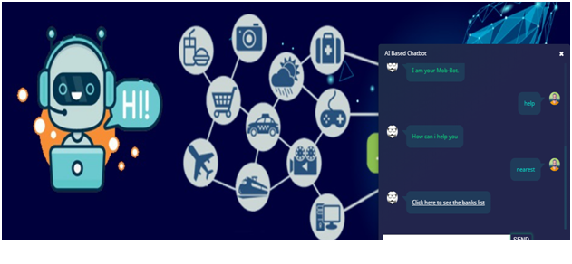

Copy the url in command prompt and paste it to google chrome
Use xampp for database
CHATBOT
Chat bots are intelligent systems that understand user’s natural language queries and respond accordingly in a conversation, which is the focus of this study. It is more like a virtual assistant, people feel like they are talking with real person. They speak the same language we do, can answer questions. In banks, at customer care centers and enquiry desks, human is insufficient and usually takes long time to process the single request which results in wastage of time and also reduce quality of customer service. The primary goal of this chat bot is, customer can interact with mentioning their queries in plain English and the chat bot can resolve their queries with appropriate response in return. The proposed system would help replicate the customer service experience with one difference that the customer would be interacting with a bot instead of a real person and yet get the queries attended and resolved. It can extend daily life, by providing solutions to help desks, telephone answering systems, customer care centers. This paper explains the dataset that we have prepared from FAQs of banks websites, architecture and methodology used for developing such chat bot. Also this paper discusses the comparison of seven classification algorithms used for getting the class of input to chat bot.

INTRODUCTION

Banks play an important role in every country’s economic development. In day-to-day life, everybody needs banks. But most of the people, especially the first-timers, struggle to know various procedures and processes required to get their work done at the bank and avail of its different products and services. Currently banks have their own web-sites, mobile applications and facilities like internet banking, mobile bank-ing but sometimes, these sources can be a bit overwhelming for most of the users who are either not well versed with technology or in some cases where the information is too scattered to search for easily. There are different types of platforms provided by different banks but people are facing problems accessing them (different GUIs, too much navigation). Although Customer Care centers are available, there are lot of weight times and redirection in some cases, leaving the customer with no choice but to experience considerable delays getting a simple informational query resolved. People have queries about various bank policies, loans, fixed deposits. This results in unnecessary crowd in banks for inquiry. Banks also face problems solving repeated queries of customers. This is time consuming and banking staff gets frustrated. Manpower and money gets wasted for separate inquiry counter.

Basics of Chat Bot
 A chat bot is a conversational agent that interacts with users in a certain domain on certain topic with natural language Sentences. Normally a chat bot works by a user asking a question or initiating a new topic. Chat bots can be called as software agents that simulate an entity usually a human. These are the software with artificial intelligence which allows them to understand users input and provide meaningful response using predefined knowledge base.

Chat Bot for Banks
 Developing a chat bot will provide a smart solution to solve these queries, provide information as and when required, improve service and increase number of customers. It removes human factors included in organization and can give 24/7 hours service to increase productivity. 
We intend to provide a chat bot interface for customers which could be available on the web and on any hand-held devices. Customers can mention their queries in natural language and the chat bot can respond to them with correct answer. Proposed chat bot application is easily accessible to customer thereby solving redundant queries anywhere anytime. As there will be fast response for inquiry, this will be time saving for both bank and customers. The proposed system would be a stepping stone in having in place an intelligent query handling program which could in next phases not just respond but self-learn to improve itself thereby increasing not just the quality of customer service but also reducing human load, increase in productivity and of course increasing number of satisfied customers. I

OBJECTIVE OF THE PROJECT

Current chat bots are developed using variety of methods like rule based where rules are hard-coded in code, AI based bots, pattern-based which can handle only mentioned patterns for retrieving answer. There are frameworks available for developing chat bots but they also use either rule-based or pattern-based techniques. 

LITERATURE SURVEY

Every Software development requires the survey process. The Survey process is needed to get the requirement for the software. The Survey also consists of studying the present system and also studying about the tools needed for the development of the software. A proper understanding of the tools is very much essential. Following is an extract of the information of the material collected during literature survey.

Determining Accuracy of Chatbot by applying Algorithm Design and Defined process

Chatbots are changing the technical world at a very fast pace now a days. The present Paper provides us insight into algorithm and design of college enquiry chatbot, both voice and text based. The motivation behind writing this paper is that it will helpful for both Professor and User s to ask any sort of questions and to comprehend rationale behind this. 
Our emphasis is based on accuracy to determine chatbot system. However, the technology which enables people to banter with machine in their language by means of a machine interface is picking up prominence in an assortment of questions mainly for user benefit. The ascent of informing application, the headways in Artificial Intelligence (AI) and psychological innovations, an interest with conversational UIs and a more extensive reach of mechanization are on the whole driving the chatbot drift. Although these components are impelling the present enthusiasm for chatbots, be that as it may, the current hype around this phenomenon may not turn out to be economical after some time without a more grounded business method of reasoning and better beneficial results.

Developing a Chatbot for bank user Program Advisement

Elective course selection often challenges User s to make decisions concerning their academic interests and other practical issues such as graduation plan, class scheduling, and difficulty of course content. Conversations with academic advisors and peers are usually considered as a useful process for obtaining official and informal information, rearranging priorities, and making compromise in the decision. The paper describes the design and development of a conversational agent called EASElective for elective course selection. EASElective is designed to complement existing academic advising services with an online natural language interactive interface that will support a conversation on topics from basic official course data to informal User s' opinions. The major design components of EASElective include intent detection, routines for conversation management, dialogue design, sustainable User s' opinion collection and analysis, and course information management. The paper also describes a study on the perceived usefulness of EASElective. The findings were found to be largely positive and EASElective has unique functions and characteristics when compared to other conventional academic advising services.

SCOPE OF THE PROJECT

The bank chatbots functioning depends on the natural language processing that helps user 
The user can ask any personal query related to doubts through the chatbot without physically available to the bank.
By using Google API for voice text and text voice conversation.
Query is sent to Chatbot and gets related answers and display answer on android app
The system’s major concern behind developing this web based platform is analyzing customer’s sentiments

ALGORITHM

Natural language processing is a subfield of linguistics, computer science ,information engineering, and artificial intelligence concerned with the interactions between computers and human(natural)languages
In particular how to program computers to process and analyse large amounts of natural language data. 
Challenges in natural language processing frequently involve speech recognition, natural language understanding, and natural language generation.

OUTPUT
 

